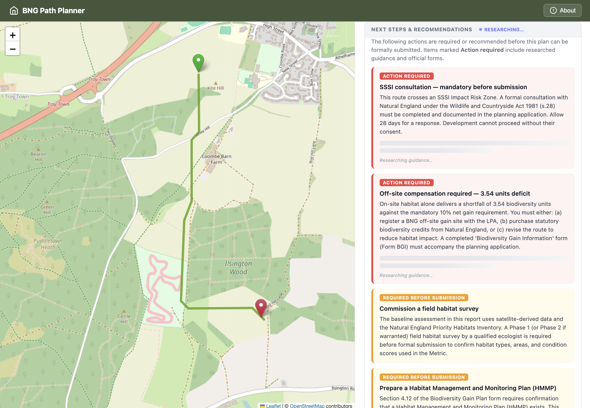
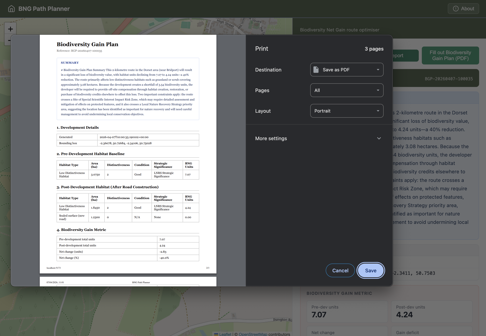

# BNG Path Planner

A full-stack web tool for calculating Biodiversity Net Gain (BNG) optimal routes in England. Drop two points on a map and the app fetches live habitat data from Natural England and Google Earth Engine, runs A* pathfinding weighted by BNG impact, and returns a scored route with a downloadable PDF report.





## The Idea

The problem is that in the UK to build an access road, the landowner must calculate the Biodiversity Net Gain (BNG) units as this is the value of the habitats that the development would be damaging and so the debt that the landowner will owe the government for the development. So if the road destroys more biodiversity than the landowner can "regrow" on their remaining land, they must buy off-site units. You can buy these onthe private market for anywhere between £15,000 and £30,000+ each, if no private units are available, the government sells them as a last resort. These can cost £42,000 to £125,000 per unit.

A route that avoids a high-value "Good Condition" oak grove in favor of a "Poor Condition" scrub patch could save the landowner hundreds of thousands of pounds in credit purchases alone.

The problem is that the current method for assessing this is through manual on site surveys so even getting a rough estimate requires an expert. The data required for a large part of the assessment is available publically on gov.uk howvwer making sense of the vast quantities of data is difficult and time consuming.

So my goal here is to simplify the task of assessing the viability of constructing new access roads / and other basic developments in rural UK areas, make it quicker, and help explain some of the process to a non environmentally - technical audience.

## The Thinking

One possible solution to this problem is providing a way of assessing the BNG Units - i.e. the environmental cost - of building an access route from A to B, providing the optimal route for minimal environmental impact, and providing a breakdown of the calculation and the explanation so that a landowner or developer (not an environmental expert) can understand the impacts of their plans.

The first step of building this was understanding what factors impact the BNG cost, through research this led to the follwoing layers: habitat type, no go zones (e.g. sssi or ancient woodland), rivers / water, elevation / slope. The goal here is to build a grid of points with weights that represent the cost of passing through each point, and then using A* route finding to get the shortest path in terms of environmental / building cost.

So first the user selects the start and end points, the bounding box is created using these. I then gather the data for each of these layers from the respective sources e.g. elevation and water from Google Earth Engine, habitat type and sssi from the gov.uk dataset api. Each layer is then represented by a matrix of values denoting most passable - 0 - to least passable - N with N scaled by the significance of that layer. Ancient woodland and water are near impassable so a have a very high value. The A* path finder then uses this combined grid to find the cheapest route from A to B. This route can then be segmented into the different types of habitat it passes through (as per the gov.uk guidelines for calculating BNG) - this is the normally arduous task of going through the dataset and finding the habitat type for each coordinate section that your route may be passing through. This then allows the tool to return a breakdown of each segment with its respective habitat type and unit cost. Finally this tool begins to implement some of the automation of filling in the https://www.gov.uk/government/publications/biodiversity-gain-plan plan application form. The output of the tool is both the segment wise breakdown of BNG units for the cheapest route, and a semi completed planning form.

The AI layer uses two Claude models. Haiku handles the plain-English report summary and PDF form field population, tasks with well-defined inputs and outputs where a lighter model is sufficient. Sonnet is used for the researcher agent, which requires the web_search tool to find current gov.uk guidance and statutory forms for high-priority actions. All other computation — cost raster assembly, A* pathfinding, BNG unit calculation, is deterministic and does not use AI.

Compiling the information into a gov.uk-friendly format - the BNG plan - uses an LLM to read through the context and fill in as much of the form as is possible given this assessment - this aims to give landowners a starting point for the plan. Note in this implementation the fields are pre-read and the LLM completes a JSON object with the reponses to the form fields before the form being recompiled as a PDF. It would be possible to structure the tool with a agent that has access to a pdf_read and a prf_write tool but for this case where there is only a single form and fixed fields this approach would be more costly for no quality gain. I've used haiku and sonnet for speed of prototyoping and because with defined enough problems there is no need for a higher performing model.

## Reflections

An overall limitation of the tool is that the quality of this assessment is not certifiable for actual planning regulations as a ground assessment will always be necessary but it can reduce the time required for a ground assessment by narrowing down the field of options for route.

In terms of the layers and routefinding, I have left out the use of deepforest or similar satellite DNNs as the processing time for these models is quite high, but similar output can be gained from building a cost raster grid from features on the gov apis or GEE. in the future if processing speed can be increased, something like deepforest helps find the canopy density in a given area and so can minimise impact within a habitat type, but this tool is primarily designed for use across a larger distance, where manual calculation and lookup is the actual user pain point.

The key llm value here is the summary of data, and completion of the pdf fields based on context and the advice. The value to the user is very much the automation of data lookup and thge conversion of that into a plain english summary. This is the arduous task that requires an environmental background, that the intended user does not have.
The advice aims to give enriched, and contextualised guidance based on the project for the next steps for the developer. This is important as government guidance is quite often compicated and not linear, as such detailing what is next in the application process can save developers significant time.

If there was more time i would build in a more micro version of the tool that then assesses vegetation density for finer tuning of the route - using image segmentation of satellite imagery. 

I would also tune further the responses for guidance, potentially working alongside an expert in the field to understand how much of the guidance can be automated or improved, which steps should be recommended and what their usual workflow would be.

Overall the ai layer has several limitations. The researcher agent fires once automatically and is not conversational — the user cannot ask follow-up questions or request alternative routes. Web search results depend on what is currently indexed; gov.uk links could change or, despite prompt safeguards, a URL could be hallucinated. The form-fill relies on a single structured LLM call; if the model deviates from the expected JSON schema, the system falls back silently to static values. The plain-English summary has no feedback mechanism — the user cannot flag if it is incorrect or request a different framing. Future improvements for this would be adding a chat and feedback mechanism on the report page, addinh structured output response for the form schema, and further eval of responses to understand what a good response would look like so that a rubric or even llm-as-judge can be built.

## Setup

### Prerequisites

| Tool | Version | Install |
|------|---------|---------|
| Node.js | 18+ | [nodejs.org](https://nodejs.org) |
| pnpm | latest | `npm install -g pnpm` |
| Python | 3.12+ | [python.org](https://python.org) |
| uv | latest | [docs.astral.sh/uv](https://docs.astral.sh/uv/) |

### 1. Backend

```bash
cd backend
cp .env.example .env   # then fill in your credentials (see backend/README.md)
uv sync
uv run uvicorn main:app --reload
```

API available at **http://localhost:8000** · Swagger docs at **http://localhost:8000/docs**

### 2. Frontend

```bash
cd frontend
pnpm install
pnpm dev
```

App available at **http://localhost:5173**

> Both services must be running simultaneously — the frontend calls the backend directly at `http://localhost:8000`.

## Further Reading

- [`backend/README.md`](backend/README.md) — API endpoints, environment variables, architecture
- [`frontend/README.md`](frontend/README.md) — component structure, build commands
